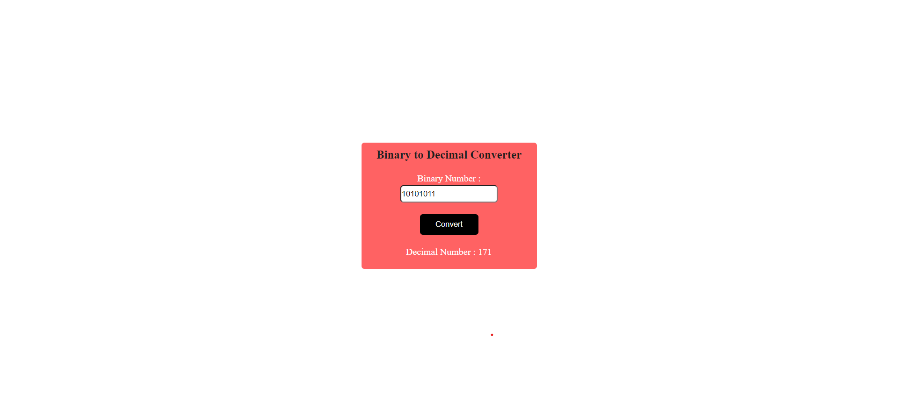

## What to build

we have to build Binary To Decimal Converter.

## Input

## Techanology used

we have used HTML, CSS and JavaScript DOM

## What I have learned from this project

I have learned how to read provided binary input and convert that binary value to decimal and than displaying on page again using JSDOM.

## Output

### Instructor

**Hitesh choudhary**
